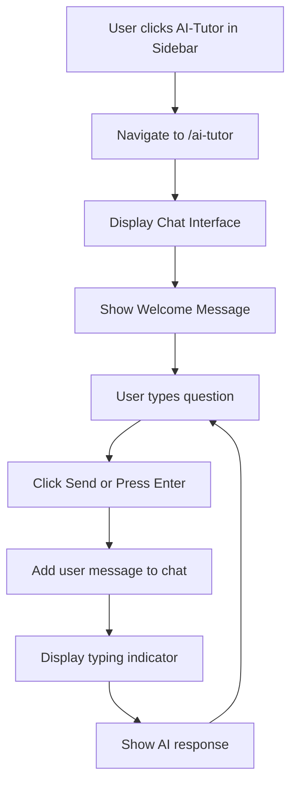

# AI-Tutor Feature Implementation Plan

## Overview
Add an AI-Tutor navigation option to the EduConnect sidebar that opens a professional AI chat interface, matching the project's existing dark theme with terracotta accents and glassmorphism effects.

## UI/UX Specification

### Layout Structure
- **Chat Container**: Full-height container with message list area and input area
- **Header**: Fixed header with AI-Tutor branding and quick actions
- **Message List**: Scrollable area showing conversation history
- **Input Area**: Fixed bottom area with text input and send button

### Visual Design (Matching Project Theme)
- **Background**: Dark gradient (`from-dark-900/60 to-dark-950/60`)
- **Cards/Messages**: Glassmorphism effect with backdrop blur
- **Accent Color**: Terracotta (#A35E47) for highlights and buttons
- **Text**: Light text on dark backgrounds
- **Borders**: Subtle borders with accent color at low opacity

### Components

#### 1. AI-Tutor Page (`src/pages/ai-tutor.vue`)
- Header with AI avatar and branding
- Welcome message/quick prompt suggestions
- Chat message bubbles (user vs AI differentiation)
- Input field with send button
- Typing indicator animation

#### 2. Sidebar Update (`src/components/layout/Sidebar.vue`)
- Add AI-Tutor navigation item with robot/chat icon
- Position after Classroom, before Profile

#### 3. Mobile Navigation Update (`src/components/layout/MobileNav.vue`)
- Add AI-Tutor option to bottom navigation

## Implementation Steps

### Step 1: Create AI-Tutor Page
**File**: `src/pages/ai-tutor.vue`
- Page meta: `definePageMeta({ layout: 'main' })`
- Mock conversation data with educational Q&A
- Chat bubble components (user = right aligned, AI = left aligned)
- Auto-scroll to bottom on new messages
- Input field with Enter key support

### Step 2: Update Sidebar Navigation
**File**: `src/components/layout/Sidebar.vue`
- Add AI icon (robot/chatbot SVG)
- Add to navItems array: `{ path: '/ai-tutor', label: 'AI Tutor', icon: aiIcon }`
- Position: After Classroom, before Profile

### Step 3: Update Mobile Navigation
**File**: `src/components/layout/MobileNav.vue`
- Add AI-Tutor to navItems
- Consider replacing "Post" or adding as additional item

### Step 4: Styling Details
- Message bubbles: Rounded corners with gradient backgrounds
- AI messages: Left-aligned with glassmorphism card style
- User messages: Right-aligned with accent gradient
- Input: Dark background with accent border on focus
- Send button: Gradient with glow effect on hover

## Acceptance Criteria
1. ✅ AI-Tutor appears in desktop sidebar navigation
2. ✅ AI-Tutor appears in mobile bottom navigation
3. ✅ Page loads with main layout (sidebar + content area)
4. ✅ Chat interface displays mock conversation
5. ✅ User can type and "send" messages (UI only)
6. ✅ UI matches project's dark theme and terracotta accent
7. ✅ Glassmorphism effects consistent with other components
8. ✅ Responsive design works on mobile and desktop

## Mermaid Diagram - User Flow

